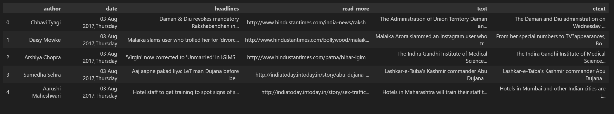
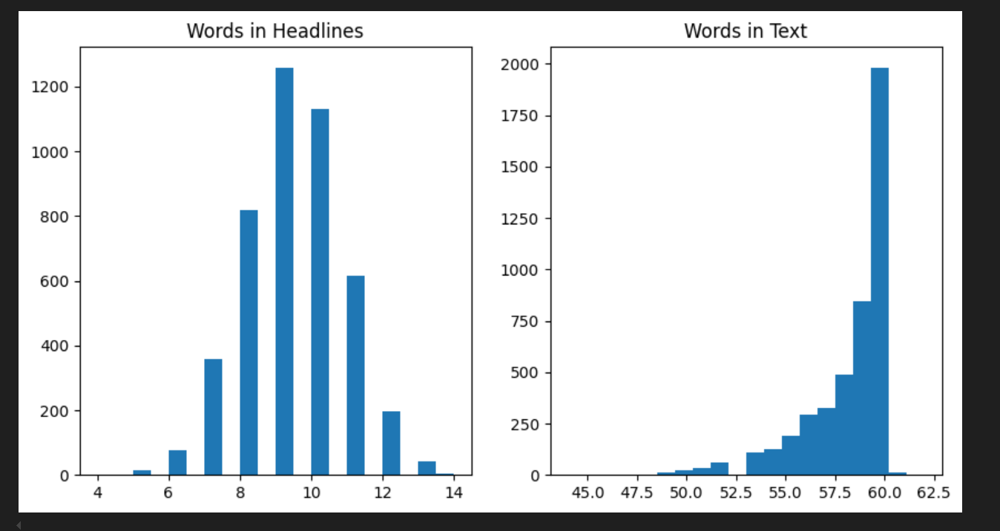
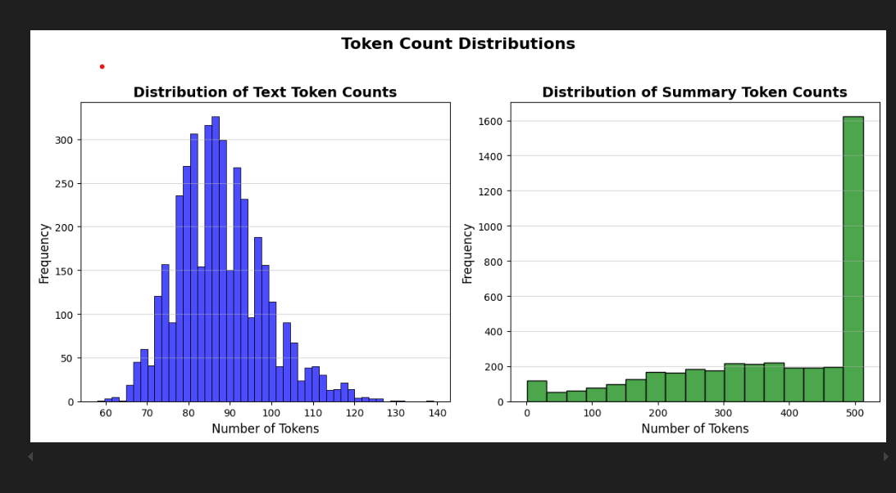

# 🧠 Text Summarization using T5 Transformer

This project demonstrates an end-to-end abstractive text summarization pipeline using the **T5 Transformer**. It leverages PyTorch and Hugging Face Transformers to train and fine-tune a model that generates concise summaries of news articles.

> 📌 **Note**:  
The notebook `NLP_Project-code.ipynb` (in the root directory) contains only code cells without outputs to keep the file lightweight and editor-friendly.  
For the **fully executed notebook with all outputs**, download and open `main.ipynb` located inside the `TextSummarization-Using-Transformers-main` folder.

---

## 📁 Project Structure
```

.
├── NLP_Project-code.ipynb # Code-only notebook (no outputs)
├── README.md # This file
├── TextSummarization-Using-Transformers-main/
│ ├── archive 2/
│ │ ├── news_summary.csv # Small dataset
│ │ ├── news_summary_more.csv # Full dataset
│ ├── main.ipynb # Fully executed notebook with output
│ ├── .DS_Store # Auto-generated system file
│ ├── sample_dataframe.png # Screenshot of sample data
│ ├── headline_words_hist.png # Histogram of headline word counts
│ └── text_token_dist.png # Histogram of token counts in text

```

---

## 📚 Dataset Overview

The project uses two versions of a cleaned news dataset:
- `news_summary.csv` – condensed version
- `news_summary_more.csv` – extended version

Each row contains:
- Article content: `text`, `ctext`
- Metadata: `author`, `date`
- Summary fields: `headlines`, `summary`

### 🖼️ Sample DataFrame  


---

## 📊 Exploratory Data Analysis

### Word Count in Headlines  
Most headlines are between 8–10 words long.  


### Token Distribution in Articles  
After tokenization, most articles fall in the range of 80–100 tokens.  


---

## 🧠 Model Summary

- Pretrained Model: `t5-small` from Hugging Face
- Encoder-decoder architecture
- Tokenization: SentencePiece
- Frameworks: PyTorch + Transformers
- Fine-tuned on cleaned news article and summary pairs

---

## 📈 Performance (Descriptive Summary Only)

Model evaluation was conducted using standard NLP metrics:
- **BLEU**
- **ROUGE-N**
- **ROUGE-L**
- Example predictions align closely with reference summaries

---

## 🛠 Tools & Technologies

- **Language Model**: T5-small
- **Libraries**: PyTorch, Hugging Face Transformers
- **Preprocessing**: Pandas, Regex
- **Visualization**: Matplotlib
- **Metrics**: ROUGE, BLEU

---
## 🧪 Sample Prediction

**📰 Original Text**  
```
Students in Delhi University will now have to wraps their heads around the historic goods and services tax (GST) that has flustered many across the country since its unveiling on July 1. GST, hailed as the country's biggest tax reform since Independence, replaced a thicket of federal and state levies while transforming Asia's third-largest economy into a single market. In a meeting this week, the varsity's academic council approved the inclusion of GST in the curriculum of commerce programmes such as B Com (Hons), B Com (Prog) and BA (Prog). It has also recommended this to the university's executive council. The move aims to help commerce students comprehend the newly introduced tax reform. The "one nation one tax" section will be taught from this academic session as the council wants changes in the course contents of B Com (Hons) in accordance with recent developments on GST.

TOP COLLEGES IN AGREEMENT  
The attempt has also brought the top colleges in agreement. "So far, goods and services tax was not included in the curriculum. Going by the status quo, it is important that students understand the tax well. We are awaiting a formal notification from the university and will include it in the curriculum for this academic year," said Reena Chadha, professor at Shri Ram College of Commerce. The university is the first in line to include the tax in the curriculum as Rajesh Jha, professor at Rajdhani College and an academic council member, pointed out that the executive is most likely to sanction the inclusion.

Experts say GST should help widen the country's tiny tax base, free up internal trade, make it easier to do business and reduce the clout middlemen wield at state borders. Governments had been trying to introduce the reform for at least 10 years, but had failed to get the support of Parliament.

The tax will be taught to students in B Com (Hons) in third and fifth semesters while B Com (Prog) students of fifth and sixth semester will have a paper on GST and Customs law. If approved by the executive council, it will also be taught to BA (Prog) students in the third and fourth semester. In a meeting concluded last week, the academic council accepted the recommendations made by the faculty of commerce and business.

**WHAT THE STUDENTS WILL BE TAUGHT**  
Students will be taught the constitutional framework of indirect taxes before GST, which include taxation powers of union and state governments, the concept of VAT, rationale and structure of GST, GST council, GST network, state compensation mechanism and registration, etc. The curriculum is also expected to include levy and collection of GST, which will cover taxable events like supply of goods and services, places of supply like within state, interstate, import and export, time of supply, valuation rules, taxability of reimbursement of expenses, and exemption from GST.

"Tax has now been simplified for our country with GST. Revenue generated from GST will be generated in a manner that will benefit India. Economists are already expecting the tax revenue to reach 2 trillion from 1 billion so students should be apprised with the times they will have to work in," said Dr Bhibhu Pratap Sahu, an assistant professor at Sri Guru Teg Bahadur Khalsa College.

Students will be taught shortcomings of pre-GST indirect taxes.  
Also Read: Foreign languages remain hot favourite among DU aspirants
```
---
```
**🤖 Predicted Summary**  

Delhi University's academic council has approved the inclusion of Goods and Services Tax (GST) in the curriculum of commerce programmes to help students comprehend the new tax regime. The "one nation one tax" section will be taught from this academic session to students in programmes such as B Com (Hons), B Com (Prog) and BA (Prog).

---

**✅ Original Summary**  
To help students comprehend the newly introduced Goods and Services Tax (GST), Delhi University's academic council approved the inclusion of GST in the curriculum of commerce programmes. The "one nation one tax" section will be taught from this academic session to students in programmes such as B Com (Hons), B Com (Prog) and BA (Prog).
```


## 🚀 Potential Improvements

- Upgrade to `t5-base` or `t5-large`
- Integrate beam search for better decoding
- Add web UI using Streamlit or FastAPI
- Incorporate multi-language support

---
## 📈 Evaluation Metrics
The model was evaluated using standard NLP summarization metrics:
{
  "BLEU": 0.782,
  "ROUGE-N": 0.886,
  "ROUGE-S": 0.803,
  "ROUGE-L": 0.772
}
These results indicate high-quality, semantically accurate summaries that closely align with ground truth.


## 🔗 Repository

📂 [GitHub Repository – T5-Transformer-NLP](https://github.com/RamKishoreKV/T5-Transformer-NLP)

---

## 📌 Credits

This project was developed by **Ram Kishore KV** with support from **Sai Aashish Pokuri** and **Alireza**, as part of an NLP coursework to explore the capabilities of Transformer-based models for sequence-to-sequence learning and summarization tasks.
